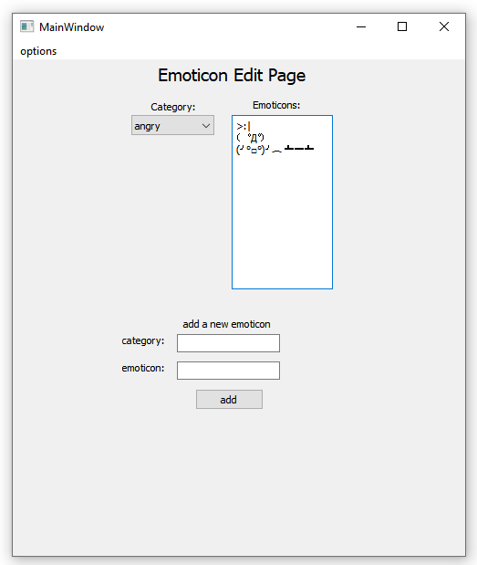
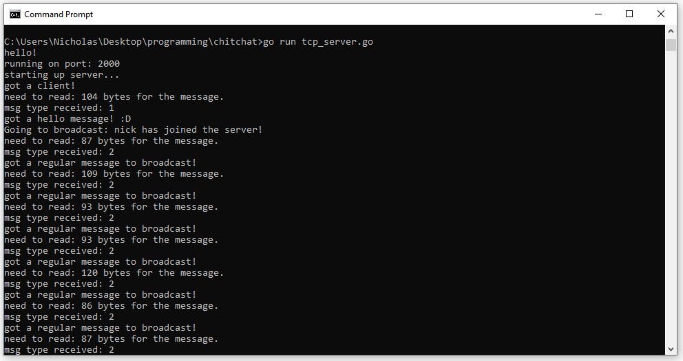

# chitchat    
    
yet another chat application made with Qt (and Go for a demo server!)    
based off of: https://github.com/syncopika/boringChat       
    
A key feature is being able to have complex ASCII/unicode emoticons on hand and ready for use! for when emojis just aren't good enough :)  
    
current look:    
    
    
    
    
    
    
    
    
I'm using JSON for messages between the server and client.    
    
## TODO:    
- make emoticon edit page/widget functional
- loading emoticons from a saved json?
- testing with multiple users
- implement avatar feature