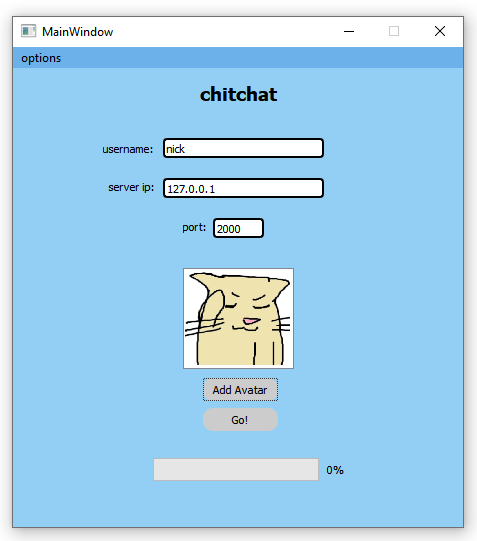
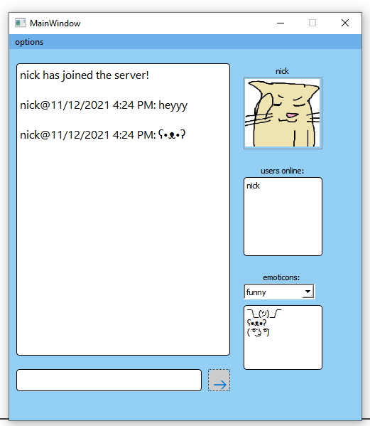

# chitchat    
    
yet another chat application made with Qt (and Go for a demo server)    
based off of: https://github.com/syncopika/boringChat    
currently a work-in-progress and only sort of functional (with a lot more work to be done)    
    
current look:    
    
    
    
    
A key feature is being able to have complex ASCII/unicode emoticons on hand and ready for use! for when emojis just aren't good enough :)    
    
## TODO:    
- change message parsing i.e. don't split on colons (a lot of emoticons use those lol)
- also length of string != num bytes to be read (duh) - need to account for that
- emoticon edit page/widget
- loading emoticons from a saved json?
- server needs to send user list/handle multiple users/broadcasting
- messages from server should come with timestamp
- implement disconnect button in chat area page
- testing with multiple users
- implement avatar feature